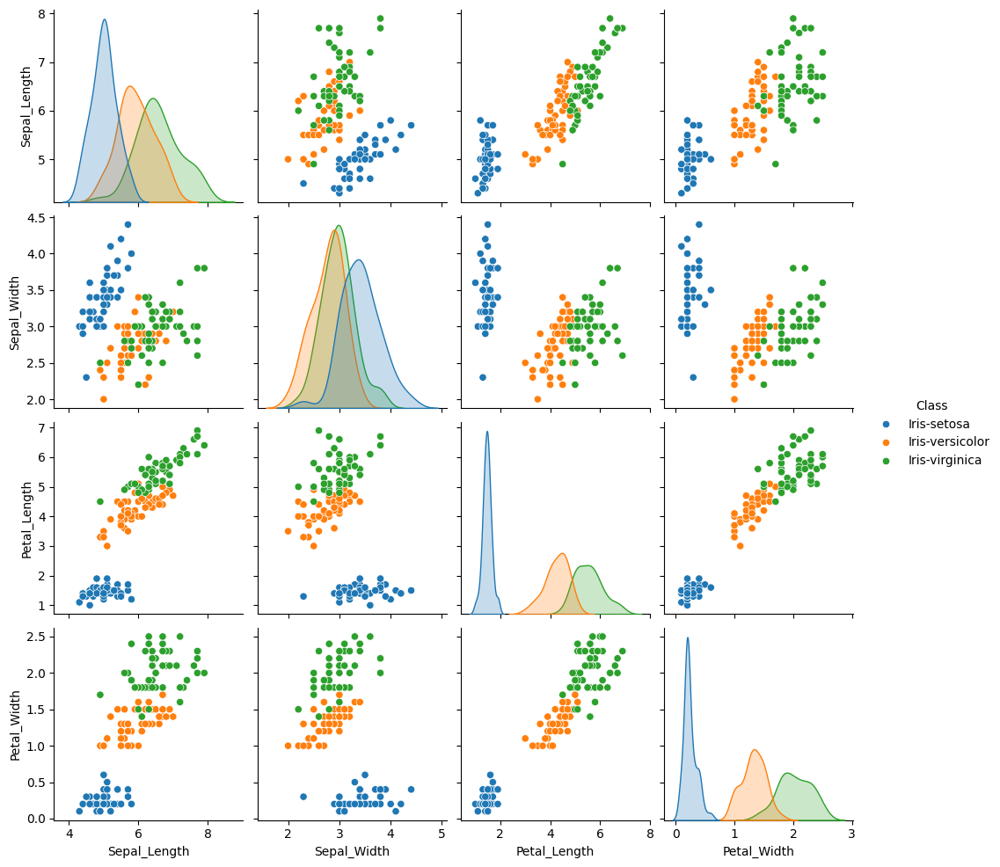

# 🤖 Deep Learning Practice: Regression & Classification

이 저장소는 TensorFlow를 활용한 회귀 및 분류 모델 실습 프로젝트들을 포함하고 있습니다. 

This repository contains deep learning projects for regression and classification using TensorFlow.

---

## 🍒 1. Cherry Yield Prediction (선형 회귀)
맑은 날의 수에 따른 체리 수확량을 예측하는 단순 선형 회귀 모델입니다. 

| 구분 (Category) | 지표 (Metrics) | 비고 (Notes) |
| :--- | :--- | :--- |
| **독립 변수** | 맑은 날 수 (day)  | Shape: [1]  |
| **종속 변수** | 체리 수확량 (product)  | Shape: [1]|
| **학습 횟수** | 20,020 Epochs | 2만 회 사전학습  |
| **예측 결과** | 51일 기준 약 1019.97 수확  | 16일 기준 319.99  |


---

## 🏠 2. Boston Housing Price Prediction (다중 회귀)
13가지 주거 환경 요인을 분석하여 주택 가격(medv)을 예측하는 모델입니다.

| 구분 (Category) | 지표 (Metrics) | 비고 (Notes) |
| :--- | :--- | :--- |
| **독립 변수** | 13개 주거 환경 요인  | crim, rm, tax 등  |
| **종속 변수** | 주택 가격 (medv)  | Target Value  |
| **모델 구조** | 퍼셉트론 1개 (Dense 1)  | Input Shape: [13]  |
| **검증 방식** | 가중치(Weights) 분석  | W1~W13 도출  |


---

## 🌸 3. Iris Species Classification (다중 분류)
꽃받침과 꽃잎의 치수를 분석하여 3가지 아이리스 품종을 분류하는 모델입니다. 

| 구분 (Category) | 지표 (Metrics) | 비고 (Notes) |
| :--- | :--- | :--- |
| **데이터 전처리** | 원-핫 인코딩 (One-hot Encoding)  | 범주형 데이터 수치화 |
| **모델 구조** | 4-Input / 3-Output  | 활성화 함수: Softmax  |
| **손실 함수** | Categorical Crossentropy  | 다중 분류 최적화  |
| **검증 데이터** | Index 45~54 (10개 샘플)  | 실제 값과 비교 검증  |

### 📈 Iris Data Analysis Result


---

## 🛠 실습 환경 (Tech Stack)
* **Language:** Python 3.x
* **Deep Learning:** TensorFlow / Keras 
* **Data Analysis:** Pandas, NumPy 
* **Visualization:** Seaborn, Matplotlib 

## 🚀 실행 방법 (Execution)
```bash
# 1. 라이브러리 설치
pip install tensorflow pandas seaborn

# 2. 각 모델 실행
python cherry.py
python boston.py
python iris.py
